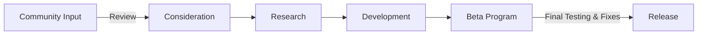

# Coreflux Roadmap 🛣

Welcome to the Coreflux Roadmap repository! This space is where we share the journey of new features from conception to release. Our roadmap is a collaborative space for the community and the Coreflux team to discuss and shape the future of  Coreflux. 🚀
[See the roadmap »](https://github.com/orgs/CorefluxCommunity/projects/1)

## Feature Development Stages

Our feature development process includes several stages that a feature goes through from the initial idea to being available for all users:

- **Community Input**: New feature ideas submitted by community members.
- **Consideration**: The Coreflux team reviews and considers the feasibility and impact of the feature.
- **Research**: We conduct thorough research to understand the requirements and implications of the feature.
- **Development**: Our developers start building the feature, transforming ideas into code.
- **Beta**: The feature is released to a limited audience for testing and feedback.
- **Release**: After thorough testing and refinements, the feature is released to all users.

## Contributing to the Roadmap

We encourage community participation at every stage of the feature development process. Here's how you can contribute:

- **Submit Feature Requests**: Share your ideas by creating a new feature request issue. 
- **Vote and Discuss**: Participate in discussions and vote on features you want to see developed.
- **Beta Testing**: Join our beta program to test new features and provide valuable feedback.

[Contribute to our roadmap »](https://github.com/orgs/CorefluxCommunity/coreflux-roadmap/blob/master/CONTRIBUTING.MD)
## Guidelines for Feature Requests

Please follow these guidelines when submitting a feature request:

- Check existing issues to avoid duplicates.
- Provide a clear and concise title.
- Describe the feature in detail, including its benefits and potential use cases.
- Engage constructively in discussions and be open to feedback.

## Feedback and Updates

We value your feedback to help us improve the roadmap and the Coreflux platform. For any suggestions or comments, please open an issue in this repository.

Stay tuned to this repository by watching it for the latest updates on our development process.

Thank you for contributing to the Coreflux community. Your insights and participation help us change the impact of data in the world!🌐 
